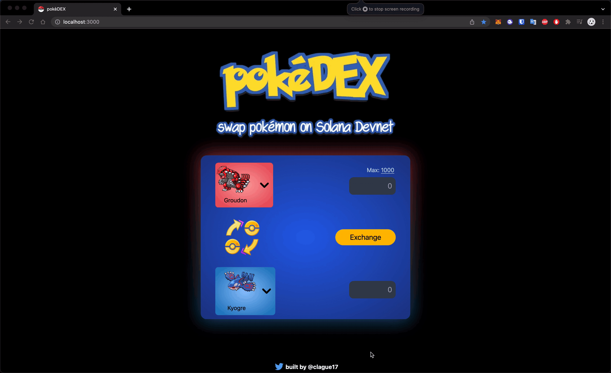

### Welcome to the pokéDEX

What is this?

It's a passion / toy project for me to get familiar with solana programming through pokemon

I coded it up on Rust through a bootcamp

#### TODO React:

- [ ] Replace the swapper bg with a gradient-radial as well as the hover: colors for the selector to spice it up
- [ ] connect phantom and allow for transactions
- [ ] Read [this](https://spl.solana.com/token-swap) and just refactor this to use the Token Swap Program
- [ ] Add animation for the linear ease when clicking the swap token direction button. I like how Orca does it visually.
- [ ] Handle the case where a user connects a wallet that has no ATAs for the two tokens -> potentially add an alert to redirect to another place where we can create one for them
- [ ] How about we don't hardcode the exchange rate and get that straight from the oracle instead :) That just requires reading in the data from the echoBuffer on the frontend
- [ ] No reason to check associated token account each time the swap token button is clicked. Should just persist that with a state var.

#### TODO Rust:

- [ ] Comb through and remove unneccesary instances of "findProgramAddress" since that can be costly. Instead save the bump seeds into the AccountInfo data for the Exchange Booth
- [ ] NOTE, this is still very unsafe, and in order for this to be production ready, I really have to test the decimal math I do when doing an exchange. There could potentially be overflows, underflows, or all kinds of things. Since this is just a proof of concept I'm not too concerned with it yet but something to keep in mind moving forward.
